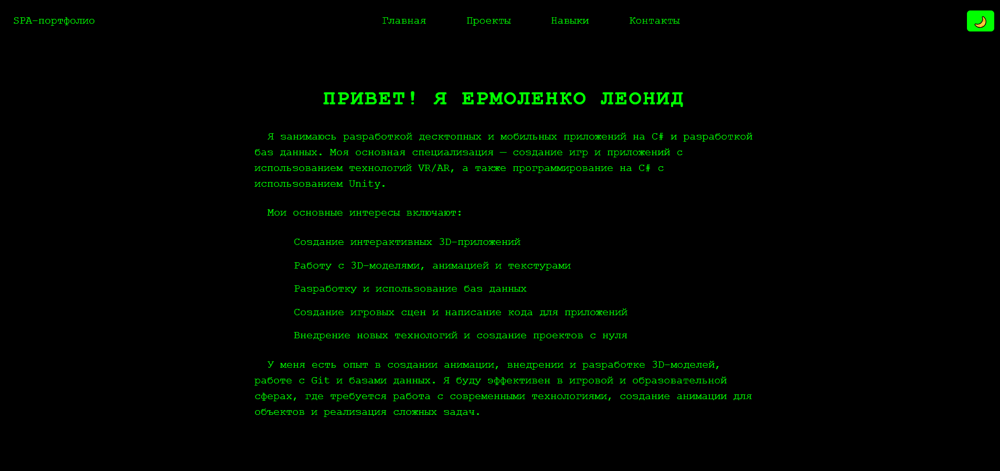
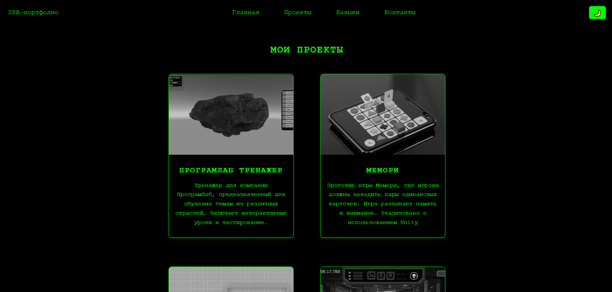
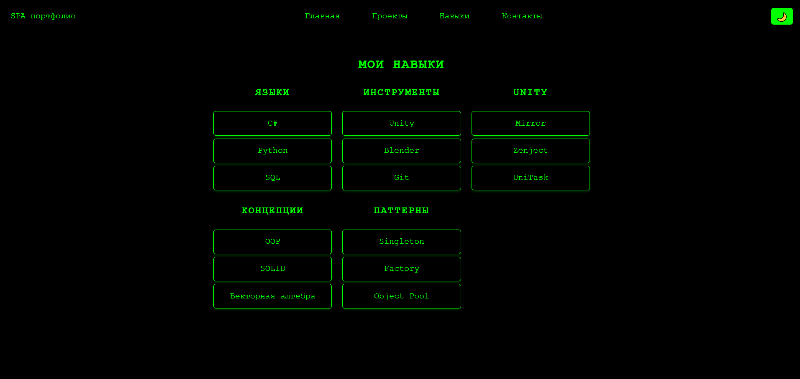
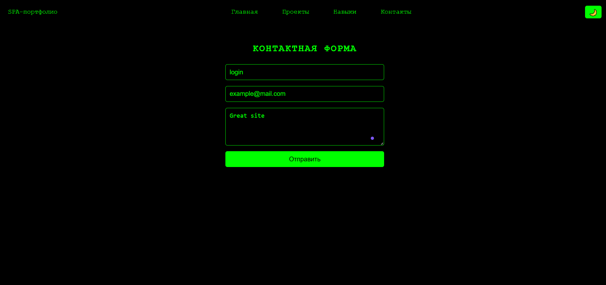

# SPA-портфолио Ермоленко Леонида

## Описание
Веб-приложение (SPA) — портфолио программиста Ермоленко Леонида. Портфолио выполнено с использованием технологий **React**, **React Router** и **CSS**, с поддержкой темного и светлого режимов оформления.

Приложение состоит из следующих разделов:
- **Главная страница**: краткая информация о себе.
- **Проекты**: список проектов, созданных автором.
- **Навыки**: перечень технических навыков и инструментов.
- **Контакты**: форма для связи.

---

## Функциональные особенности

### 1. Темная и светлая темы
Пользователь может переключать между темным и светлым режимами отображения сайта. Приложение автоматически определяет предпочтительную тему системы пользователя при первом запуске.

### 2. Адаптивный дизайн
Сайт корректно отображается на устройствах с различными разрешениями экрана: от мобильных телефонов до десктопных мониторов.

### 3. Мобильное меню
На мобильных устройствах появляется кнопка, которая позволяет удобно перемещаться по сайту.

### 4. Контактная форма
Форма содержит поля ввода имени, email и сообщения. На стороне клиента реализована простая обработка данных через `console.log`.

### 5. Динамические компоненты
Использование React обеспечивает высокую производительность и модульность кода. Все элементы интерфейса реализованы в виде отдельных компонентов.

---

## Структура проекта

```
spa-portfolio/
│
├── public/
│   └── images/            # Изображения проектов
│
├── src/
│   ├── components/        # Компоненты React
│   │   ├── Home.jsx       # Главная страница
│   │   ├── Projects.jsx   # Страница с проектами
│   │   ├── Skills.jsx     # Навыки
│   │   ├── Contact.jsx    # Контактная форма
│   │   └── Navbar.jsx     # Навигационное меню
│   │
│   ├── App.jsx            # Основной компонент приложения
│   ├── index.js           # Точка входа
│   └── styles.css         # Стили проекта
│
├── package.json           # Зависимости и скрипты
└── README.md              # Информация о проекте
```

---

## Используемые технологии

- **React** — библиотека для создания пользовательских интерфейсов.
- **React Router** — для навигации между разделами сайта.
- **CSS** — стилизация и анимации.
- **HTML5 / ES6+** — современный стандарт верстки и JavaScript.

---

## Установка и запуск

### Требования
- [Node.js](https://nodejs.org/) (версия 14.x или выше)
- npm или yarn

### Установка

```bash
# Клонирование репозитория
git clone https://github.com/DiCaprioLeonardo/spa-portfolio.git

# Переход в папку проекта
cd spa-portfolio

# Установка зависимостей
npm install
# или
yarn install
```

### Запуск локального сервера

```bash
# Запуск dev-сервера
npm run dev
# или
yarn dev
```

Откройте [http://localhost:3000](http://localhost:3000) в браузере, чтобы увидеть результат.

---

## Как использовать

- Перейдите по ссылкам в меню, чтобы просмотреть разделы:
  - **Главная** — информация о разработчике.
  - **Проекты** — список завершённых работ.
  - **Навыки** — технические знания и опыт.
  - **Контакты** — форма обратной связи.
- Переключайте тему оформления с помощью кнопки в правом верхнем углу.
- На мобильных устройствах используйте кнопку меню для навигации.

---

## Возможности для расширения

1. **Добаление API** — можно отправлять данные формы на сервер.
2. **База данных** — хранить проекты и навыки не в коде, а в БД.
3. **Админ-панель** — добавление новых проектов без изменения кода.
4. **Мультимедиа** — добавление видео и превью проектов.

---

## Лицензия
MIT License — вы можете свободно использовать, изменять и распространять этот проект.

---

## Автор
Ермоленко Леонид  
Email: leonid_ermolenko@inbox.ru 
GitHub: [https://github.com/DiCaprioLeonardo](https://github.com/DiCaprioLeonardo)

---


## Скриншоты





---

## Заключение
Это портфолио демонстрирует навыки и достижения разработчика в сфере разработки игр и приложений на C#, Unity и Blender. Проект легко расширяем и готов к дальнейшей доработке под нужды конкретного пользователя или компании.